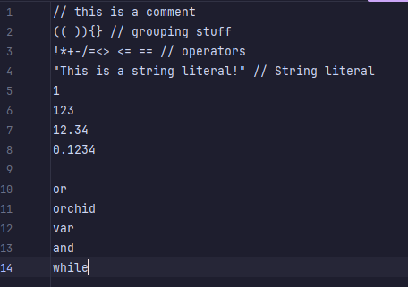
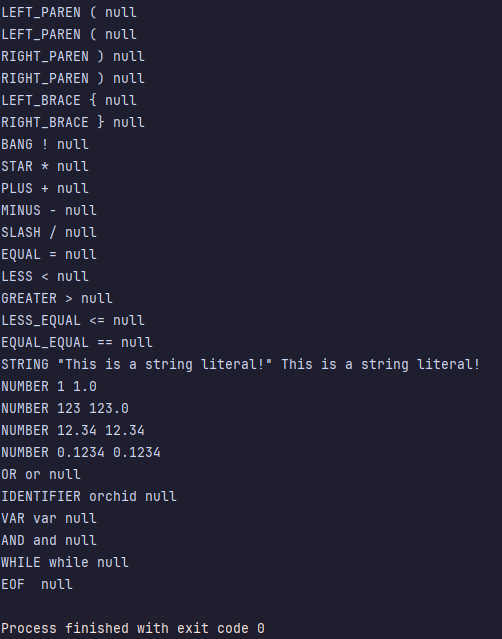
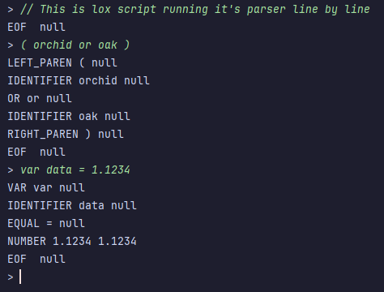

# jLox - A simple hobby-language interpreter written in java

 

This project is a record of my journey as I read the wonderful ["Crafting Interpreters"](https://craftinginterpreters.com/) by Robert Nystrom.

Lox is a simple to understand high-level interpreted language with C-like syntax, and dynamic typing. jLox is the first of two Lox interpreters laid out in the book. 
It is written in the Java programming language, and is intended to prioritize the teaching of basic concepts over efficiency / speed. 
I will be adding sections below as this program passes certain benchmarks.

### Benchmarks
- [X] Implement a basic scanner / tokenizer
- [ ] Implement a logical parsing system
- [ ] Implement a system to evaluate expressions
- [ ] Implement a system to handle states and statements
- [ ] Implement control flow
- [ ] Implement functions
- [ ] Implement classes
- [ ] Implement inheritance

## Implement A Basic Scanner / Tokenizer

The program can now read Lox script in two forms: by reading in a .lox file, or by using a python-style terminal-level interactive interpreter.
In both cases, the lox script is read in and then scanned character by character. As characters are consumed, the scanner will generate a list 
of tokens. These tokens represent things such as parentheses, braces, logical operators, arithmetic operators, reserved keywords, and variable identifiers.
Once the script has been tokenized, the program prints them to the terminal in the order they were scanned.

### Method 1: Reading A Lox Script File

I used the above lox script ( test.lox ) to test the parser

 
 
 

Here is the output of the parser after scanning the above test.lox file

 
 

### Method 2: Live Interpreter

Here is a screenshot of the liver Lox interpreter
